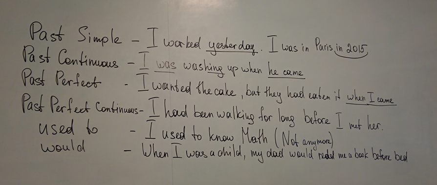

### Constructions in the past

Amina

__Past simple__
+ I worked yesterday. I was in Paris in 2015.

__Past continuous__
+ I was washing up when he came

__Past perfect__
+ I wanted the cake, but they had eaten it when I came

__Past perfect continuous__
+ I had been walking for long before I met her.

__used to__
+ I used yo know Math (not anymore)

__would__
+ When I was a child, my dad would read me a book before bed.

