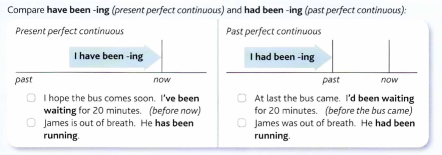

### Past perfect continuous (I had been doing)

Murphy p. 32

Явное указание на длинную продолжительность действия до другого действия (оба действия в прошлом).

----

+ It had been raining
+ It _was not raining_ when I looked out the window, the sun was shining. But it __had been__ raining before.
+ James was out of breath. __He had been running.__
+ It _wasn't raining_ when we went out. The sun _was shining_. But it __had been raining__, so the ground _was wet_.
+ Kate _was sitting_ in chair resting. She was tired because __she'd been working__

Some verbs of state like know and like are not normally used in continuous:
+ We were good friends. We __had known__ each other for years. _(not had been knowing)_

----

Compare __have been doing (pres perf count)__ and __had been doing (past perf count)__:

----

## Homework

p.33 Ex 16.1

1. I had been working hard all day.
1. They had been playing football tough.
5. I had been looking forward to it.
3. She had a bad dream
4. He had watched a film

p.33 Ex 16.2

1. We had been playing for half an hour when it started to rain.
2. I had been waiting for 20 minutes when I realized that I was in the wrong restaurant.
3. At the time the factory __closed down__, Sarah __had been working__ there for 5 years.
4. The orchestra __had been playing__ about 10 minutes when a man in the audience __started to shout__.
5. I had been walking about 15 minutes from home to office when suddenly it started to rain.

p.33 Ex 16.3

    Past countinuous (I was doing), past perfect (I had done), or past perf cont (I had been doing)

1. It was very noisy next door. Our neighbors were having a party.
2. We were good friends. We had known each other for years.
3. John and I went for a walk. I had difficulty keeping up with him because he had been walking so fast.
4. Sue was sitting on the ground. She was out of breath. She had been running.
5. When I arrived, everybody was sitting round the table with their mouths full. They were eating.
6. When I arrived, everybody was sittign round the table and talking. Their mouths were empty, but their stomachs were full. They had been eating.
7. James was on his hands and knees on the floor. He was looking for his contact lens.
8. When I arrived, Kate had been waiting for me. She was annoyed because I was late and she had been waiting for a long time.
9. I was sad when I sold my car. I had had it for a very long time.
10. We were extrimely tired at the end of the journey. We had been traveling for more than 24 hours.
